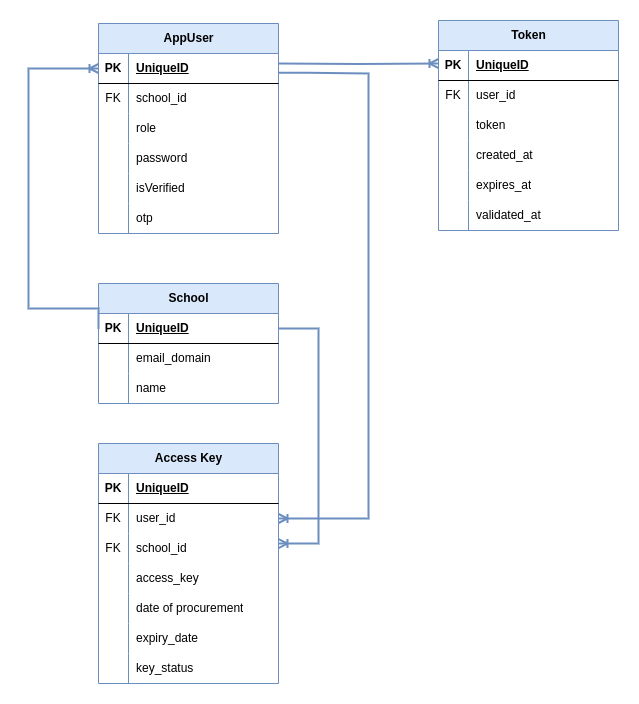

# Access Key Manager

## Project Overview

The Access Key Manager is a web application designed to facilitate the management and distribution of access keys for the school management platform developed by Micro-Focus Inc. The platform is multitenant, allowing various schools to set up on it, and it utilizes an access key-based approach for monetization.

## Customer Requirements

### School IT Personnel

1. **Signup and Login**: Ability to signup and login with an email and password, with account verification. Includes a reset password feature.
2. **Access Key List**: View a list of all access keys granted, including active, expired, or revoked keys.
3. **Access Key Details**: For each access key, view the status, date of procurement, and expiry date.
4. **Access Key Activation**: Prevent users from obtaining a new key if an active key is already assigned. Only one key can be active at a time.

### Micro-Focus Admin

1. **Admin Login**: Ability to login with an email and password.
2. **Key Revocation**: Ability to manually revoke a key.
3. **Access Key List**: View all keys generated on the platform, including status, date of procurement, and expiry date.
4. **Integration Endpoint**: Access an endpoint to retrieve details of the active key for a given school email. Returns status code 200 and key details if found, else returns 404.

## Deliverables

1. **Web Application Source Code**: Hosted on GitHub, implementing Git flow with a reasonable number of commits. Includes a well-written README file.
2. **ER Diagram**: Database design diagram demonstrating the relationship between entities.
3. **Deployed Link**: Link to the deployed web application.

### ER DIAGRAM

### [Deployed link](http://13.49.221.156:8080/swagger-ui/index.html)

## Usage

### School IT Personnel

1. Sign up for an account using your email and password.
2. Log in to access the dashboard.
3. View your list of access keys and their details.
4. Purchase a new access key if no active key is assigned.

### Micro-Focus Admin

1. Log in to the admin dashboard using your credentials.
2. View all access keys generated on the platform.
3. Manually revoke access keys if necessary.
4. Access the integration endpoint to retrieve active key details for a school.

## Technologies Used

- **Backend**: Java (Spring Boot)
- **Database**: Postgres

## Getting Started

1. Clone the repository from GitHub.
2. Set up the backend server and database.
3. Install dependencies and run the frontend application.
4. Access the application through the provided deployed link.
